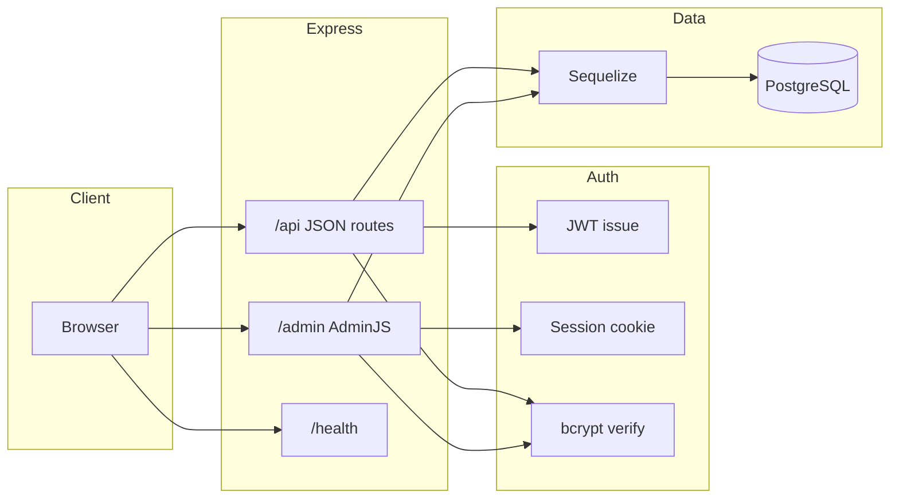

# Role-Based eCommerce Admin Dashboard

## 1. Title + badges


## 2. Description

A **secure admin panel** for a minimal **eCommerce** domain: user accounts, product catalog, customer orders, and key-value settings. The server is **Node.js + Express**, persistence is **Sequelize + PostgreSQL**, the UI is **AdminJS** (session login), and the JSON API uses **bcrypt** + **JWT** for programmatic auth. **Role-based access control** hides admin-only resources from regular users and scopes orders to the signed-in customer.

This project targets coursework / portfolio demos: it is **not** a full marketplace (payments, cart APIs, inventory locking) but it models the **core relational data** shops rely on.

## 3. Tech stack

| Layer | Technology |
|--------|------------|
| Runtime | Node.js 18+ |
| HTTP | Express 4 |
| Admin UI | AdminJS 6, `@adminjs/express`, `@adminjs/sequelize` |
| ORM / DB | Sequelize 6, `pg`, PostgreSQL |
| Auth | bcrypt (passwords), `jsonwebtoken` (API), `express-session` (AdminJS) |
| Config | dotenv |
| Security | helmet (CSP disabled for AdminJS), express-rate-limit (login) |
| Dev | nodemon, `@adminjs/bundler` |

## 4. Features

- **Six Sequelize models**: `User`, `Category`, `Product`, `Order`, `OrderItem`, `Setting` with associations (catalog, orders, line items).
- **AdminJS** registers all models with sensible list/show columns and navigation grouping (**Catalog**).
- **Password field** hidden from list / show / filter / edit; new users created in Admin can get an auto-generated password via a `new` action hook when the field is empty.
- **JWT** `POST /api/login` for API clients; **AdminJS** uses **email/password** + **session** (same user table).
- **RBAC**: `admin` sees all resources, custom **dashboard** (stats vs. recent orders), **SiteConfiguration** page for settings; `user` does not see User or Setting resources; **orders** filtered to `userId`; **OrderItem** list is admin-only (line items still visible on own order detail).
- **Health** endpoint for deployments; **production guards** for `DB_SYNC` and destructive `seed` (see [Environment Variables](#8-environment-variables)).

## 5. Project architecture & project structure

### Architecture (high level)



### Repository layout

```text
adminPanel/
├── app.js                 # Express app, helmet, AdminJS router, lifecycle
├── seed.js                # Destructive demo seed (sync force + inserts)
├── package.json
├── Procfile               # Example process type (e.g. Heroku)
├── render.yaml            # Example Render blueprint
├── config/
│   ├── database.js        # Sequelize + SSL/pool + DATABASE_URL or DB_*
│   └── env.js             # Startup env validation (production rules)
├── middleware/
│   └── apiLimiter.js      # Rate limit for POST /api/login
├── models/                # Sequelize models + index.js associations
├── routes/
│   └── auth.js            # POST /api/login
├── admin/
│   ├── setup.js           # AdminJS instance, dashboard + SiteConfiguration page
│   ├── resources.js       # Per-resource RBAC + navigation
│   ├── dashboard.jsx      # Custom dashboard UI
│   └── settings.jsx       # Custom settings UI
└── docs/                  # Branch scope notes, publish checklist
```

## 6. Prerequisites

- **Node.js** 18 or newer  
- **PostgreSQL** database (local, [Supabase](https://supabase.com/), Neon, Railway, etc.)  
- **npm** (ships with Node)  
- Optional: **Docker** if you prefer containerized Postgres  

## 7. Installation

```bash
git clone <your-repo-url>
cd adminPanel
cp .env.example .env
# Edit .env — see section 8

npm install
```

**Development server**

```bash
npm run dev
```

- App root redirects to **`/admin`**.  
- Admin UI: `http://localhost:<PORT>/admin` (default port **3000**).

**Production-style start** (set env on the host or use `start:prod` if your shell supports inline `NODE_ENV`):

```bash
npm start
# or
npm run start:prod
```

**AdminJS client bundles** are built when the server starts in development; for some hosts you may run `npm run build:admin` during deploy (see `render.yaml` example).

## 8. Environment variables

Copy [`.env.example`](.env.example) to `.env` and configure:

| Variable | Required | Description |
|----------|----------|-------------|
| `PORT` | No | HTTP port (default `3000`) |
| `NODE_ENV` | Recommended | `development` / `production` |
| `DATABASE_URL` | One of URL **or** `DB_*` | Full Postgres URI (e.g. Supabase pooler or direct) |
| `DB_NAME`, `DB_USER`, `DB_PASS`, `DB_HOST`, `DB_PORT` | If no `DATABASE_URL` | Discrete connection fields |
| `DB_SSL` | For local discrete vars | `false` for localhost; Supabase URL auto-SSL in code |
| `DB_POOL_MAX`, `DB_POOL_MIN`, … | No | Sequelize pool tuning |
| `JWT_SECRET` | Yes | Secret for signing JWTs |
| `COOKIE_SECRET` | Yes | Session / AdminJS cookie signing (must differ from `JWT_SECRET` in production) |
| `DB_SYNC` | No | `true` only in dev to `sync({ alter: true })` on boot — blocked in production unless `ALLOW_DB_SYNC_IN_PRODUCTION=true` |
| `TRUST_PROXY` | Behind reverse proxy | `true` so Express trusts `X-Forwarded-*` |
| `SESSION_COOKIE_SECURE` | HTTPS | `true` in production behind TLS |
| `SESSION_MAX_AGE_MS` | No | Admin session duration (ms) |
| `API_LOGIN_MAX_ATTEMPTS` | No | Rate limit window cap for `/api/login` |
| `ALLOW_SEED_IN_PRODUCTION` | Danger | Must be `true` to allow `npm run seed` when `NODE_ENV=production` |

**Production rules** (enforced in [`config/env.js`](config/env.js)): `JWT_SECRET` and `COOKIE_SECRET` must each be **≥ 32 characters** and **not identical** when `NODE_ENV=production`.

## 9. Database setup

### Option A — Supabase (recommended)

1. Create a project at [supabase.com](https://supabase.com/).  
2. **Project Settings → Database** → copy the **URI** (prefer **Session pooler** / IPv4 if direct host times out).  
3. Set `DATABASE_URL` in `.env` and replace the password placeholder.  

### Option B — Local PostgreSQL

```bash
createdb ecommerce_admin
```

Set `DB_NAME`, `DB_USER`, `DB_PASS`, `DB_HOST`, `DB_PORT`, and `DB_SSL=false` in `.env`. **Do not** set `DATABASE_URL`.

### Schema & demo data

1. **Optional first boot (dev):** set `DB_SYNC=true`, run `npm run dev` once, then set `DB_SYNC=false`.  
2. **Seed demo rows** (drops and recreates **all** tables):

```bash
npm run seed
```

See [Seed Data](#12-seed-data) for accounts. **Never** run seed against production without understanding `ALLOW_SEED_IN_PRODUCTION`.

## 10. API endpoints

Base URL: `http://localhost:<PORT>` (replace `<PORT>` with your `PORT`, default `3000`).

| Method | Path | Auth | Description |
|--------|------|------|-------------|
| `GET` | `/health` | None | `{ status, uptime }` for load balancers |
| `GET` | `/` | None | Redirects to `/admin` |
| `POST` | `/api/login` | None | JSON body `{ "email", "password" }`. Success: `{ "token", "user": { id, email, role } }`. Errors: `400` / `401` / `500` with `{ "error" }`. Rate-limited. |
| `*` | `/admin/*` | Session | AdminJS UI (login form → session cookie) |

AdminJS also exposes internal JSON under `/admin/api/...` for the SPA (dashboard, resources, custom page **SiteConfiguration**).

## 11. Roles & permissions

| Role | AdminJS | Notes |
|------|---------|--------|
| **admin** | Full CRUD on **User**, **Category**, **Product**, **Order**, **OrderItem**, **Setting** | Dashboard shows aggregate stats (users, orders, products, categories, revenue). **SiteConfiguration** page and Setting resource. |
| **user** | **No** User or Setting resources in the nav | **Orders**: list filtered to own `userId`; **show** only own orders. **OrderItem**: no list access; **show** allowed when the parent order belongs to the user. **Categories** & **Products** visible for catalog context. Dashboard shows profile + recent orders. |

Implementation: [`admin/resources.js`](admin/resources.js) (`isAccessible`, `list` `before` hooks, `navigation` groups).

## 12. Seed data

Run **`npm run seed`** after DB is reachable. This runs `sequelize.sync({ force: true })` — **all tables are dropped and recreated**.

| Entity | Summary |
|--------|---------|
| Users | `admin@example.com` (role `admin`), `user@example.com` (role `user`) |
| Passwords | `admin123` / `user123` (plain in seed; stored hashed via model hooks) |
| Catalog | Categories *Electronics*, *Books*; sample products |
| Orders | Two orders for the seeded `user`, with line items |
| Settings | `site_name`, `tax_rate`, `currency` |

## 13. Branch strategy

| Branch | Purpose |
|--------|---------|
| `main` | Production-ready releases |
| `dev` | Integration branch for completed features |
| `feature/models` | Database / Sequelize model work |
| `feature/auth` | JWT + AdminJS authentication |
| `feature/rbac` | RBAC, dashboards, custom pages |
| `feature/production-readiness` | Ops, env validation, deploy examples |

**Workflow:** branch from `dev` → implement on `feature/*` → merge into `dev` → when stable, merge `dev` into `main` and push.

```bash
git checkout dev
git pull origin dev
git checkout -b feature/your-topic
# ... commits ...
git checkout dev
git merge feature/your-topic -m "Merge feature/your-topic"
git checkout main
git merge dev -m "Release: merge dev into main"
git push origin main dev
```

Optional reviewer notes: [`docs/branch-scope-models.md`](docs/branch-scope-models.md), [`docs/branch-scope-auth.md`](docs/branch-scope-auth.md), [`docs/branch-scope-rbac.md`](docs/branch-scope-rbac.md), [`docs/branch-scope-production.md`](docs/branch-scope-production.md), [`docs/PUBLISH_CHECKLIST.md`](docs/PUBLISH_CHECKLIST.md).

---

## Assignment checklist (quick reference)

- [ ] Public GitHub repository  
- [ ] Branch strategy (`main`, `dev`, `feature/*`)  
- [ ] Six models + AdminJS resources + hidden password fields  
- [ ] `POST /api/login` + JWT; AdminJS session login  
- [ ] Admin vs user RBAC + custom dashboard + SiteConfiguration page  
- [ ] `.env` gitignored; README complete  
